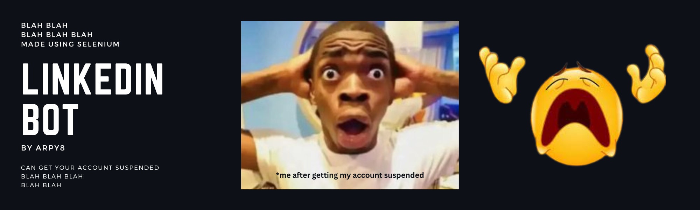

# LinkedIn Follow Bot using Selenium


   


This is a simple LinkedIn Follow Bot implemented using Selenium, a web automation tool. The bot allows you to automatically follow users on LinkedIn based on certain search criteria. It's important to note that using automated bots on LinkedIn might violate their terms of service, so use this script responsibly and consider the potential consequences.

## Prerequisites

- Python 3.8 or 3.9 installed
- Selenium library (`pip install selenium`)
- Chrome WebDriver - Make sure you have the Chrome WebDriver installed and added to your system's PATH. You can download it from [here](https://sites.google.com/chromium.org/driver/).

## Usage

1. Clone this repository:

   ```bash
   git clone https://github.com/arpy8/Linkedin_Follow_Bot.git
   ```

2. Navigate to the project directory:

   ```bash
   cd Linkedin_Follow_Bot
   ```

3. Install the required dependencies:

   ```bash
   pip install -r requirements.txt
   ```

6. Run the executable file:

   ```bash
   main.exe
   ```

7. Sit back and watch as the bot logs into your account, and sends connection requests automatically.

## Demo


## Disclaimer

This bot is intended for educational purposes and personal use only. The use of automated bots on LinkedIn may violate LinkedIn's terms of service. Use this script responsibly and at your own risk.

## License

This project is licensed under the MIT License - see the [LICENSE](LICENSE) file for details.

---

**Note:** Using automated bots on platforms like LinkedIn can lead to account suspension or other consequences. Always be cautious and respect the terms of service of the platform you are interacting with. This project is provided as an example and should not be used for any malicious or unethical purposes.
